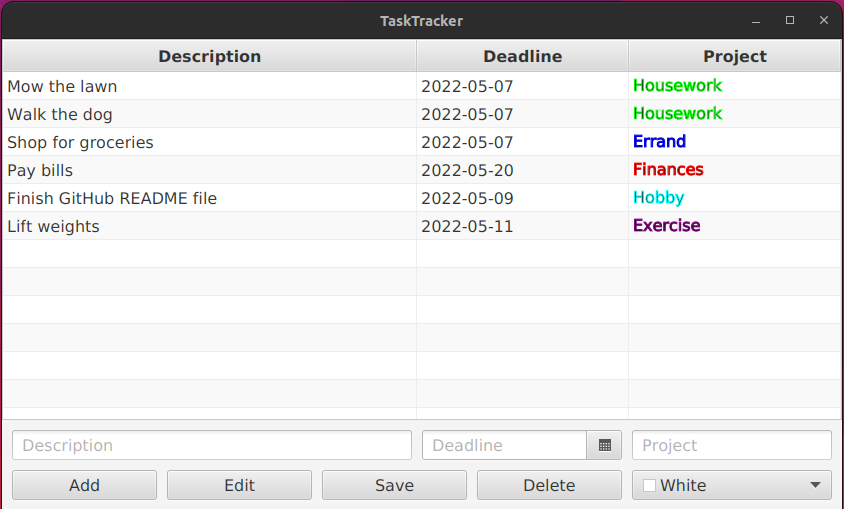
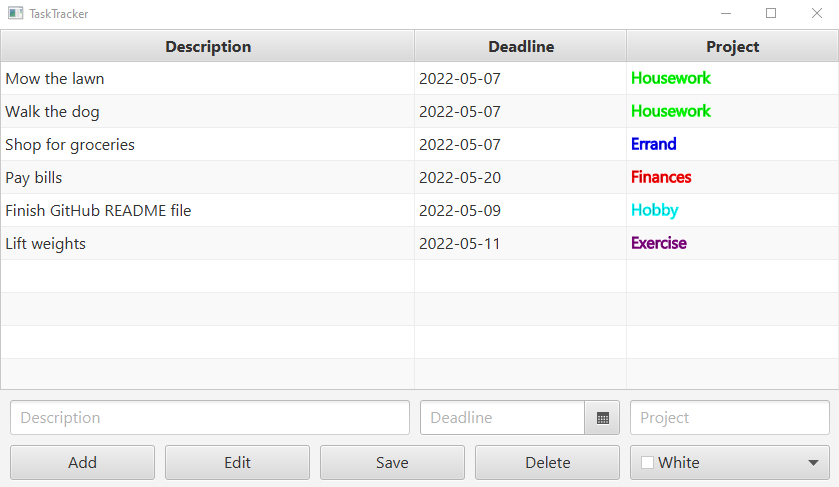

# TaskTracker

> A desktop to-do list application that uses Google Sheets and Drive APIs to persist data. It provides the user with a clean graphical interface for managing their day-to-day tasks.


## Built With

- Java
- JavaFX | OAuth
- Gradle | Google Sheets API | Google Drive API


## Getting Started

To get a local copy up and running follow these simple steps!


### Prerequisites

- Java 8+
- Google account


### Setup

*Note: you can try the application without data persistence by cloning the repository and skipping to the "Build" section.*

The application utilizes Google Sheets and Drive APIs to store and retrieve data. In order for you to use these features, you will have to [create a Google Cloud project](https://developers.google.com/workspace/guides/create-project).

Once you have a project, you will then need to [enable the Sheets and Drive API's](https://developers.google.com/workspace/guides/enable-apis).

After this is done, you can now [create your OAuth credentials](https://developers.google.com/sheets/api/quickstart/java). Download the JSON file generated for your new credentials and call the file `credentials.json`.


### Install

Once you have your OAuth client credentials, you are ready to install!

First clone the repository to a directory on your local machine.
```
git clone https://github.com/ghorned/TaskTracker
```
Next, move the downloaded credentials to the `resources` directory inside the repository.
```
mv path/to/credentials.json src/main/resources
```


### Build

You are now ready to build and run the application!

First, make sure you are at the project directory's root level, then build the application using the Gradle wrapper:
```
./gradlew clean build // For Unix based machines

gradlew.bat clean build // For Windows
```


### Run

Now that the project is built, there are a couple of options for running it.

#### Run using Gradle wrapper

The most straightforward way to run the application is to use the Gradle wrapper.
```
./gradlew run // For Unix based machines

gradlew.bat run // For Windows
```

#### Run using fat jar

Alternatively, building the project also generates a fat jar file that can be used for launching the application.
```
java -jar build/libs/TaskTracker-1.0-SNAPSHOT.jar
```


### Usage

When the application first starts up the user's default browser should pull up a Google sign-in page. The user will be asked for the account they wish to use with the application and then the application will ask for permission to access the user's data. The application will only access files that it creates itself. On first startup the application will create a spreadsheet called "TaskTracker" and will use this to store all future data. Storing this spreadsheet with Google Sheets allows the user to run the application from different client machines and still access their same to-do list.



After authentication, a window will pop up which consists of two primary components: the table of current tasks and the editing panel. In order to add a task, the user simply provides a description of the task, its deadline, and a project name and color-code (used for grouping multiple tasks) in the designated fields, then clicks `Add`. All fields must be filled in order for an item to be added.



In order to remove an already existing task, the user clicks on the row listing it. Once it is highlighted, the user can then click `Delete` and it will be removed from the list.

To edit an existing task, click the row you want to change and then click `Edit`; the editing panel will autofill with the input for that task, and it can then be changed. To save these changes, click `Save`.

Whatever tasks are currently being displayed in the table will be saved automatically upon exiting out of the application window.

The table is also capable of sorting tasks based upon their description, deadline, or project name values simply by clicking the top header of that respective column.